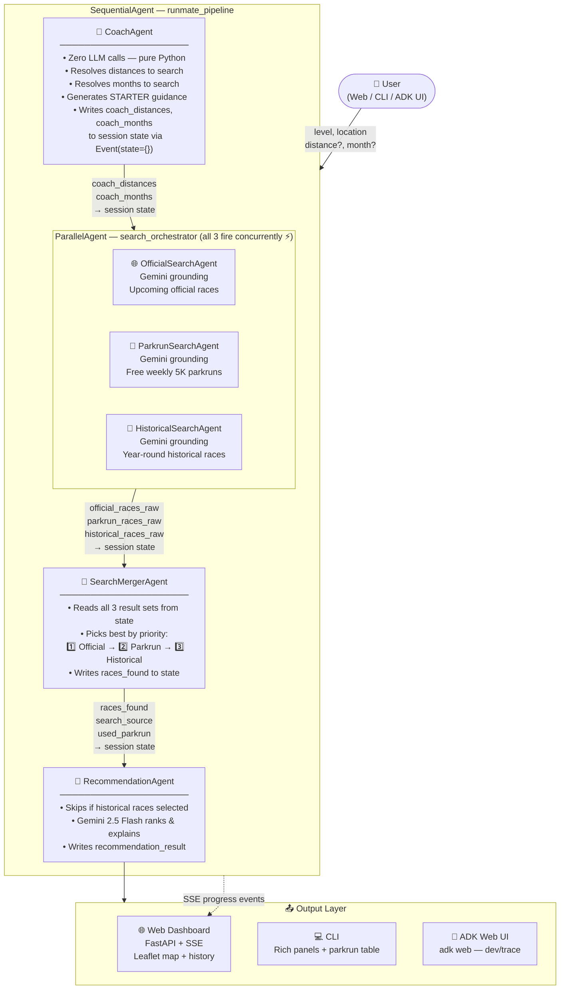

# RunMate AI 🏃

> An AI-powered running companion built with [Google Agent Development Kit (ADK)](https://google.github.io/adk-docs/) that helps runners discover races matched to their experience level and location.

[](https://www.python.org/)
[](https://google.github.io/adk-docs/)
[](https://aistudio.google.com/)
[](https://fastapi.tiangolo.com/)
[](LICENSE)

---

## What It Does

RunMate takes your **runner level** and **location** and returns personalised race recommendations — real upcoming events, ranked and explained by AI.

| Input | Example |
|---|---|
| Level | `STARTER` or `RUNNER` |
| Location | `Leeds, UK` |
| Distance _(optional)_ | `5K`, `10K`, `Half Marathon`, `Marathon` |
| Month _(optional)_ | `July`, `August` |

The agent pipeline runs **three specialised ADK agents in sequence**, then presents ranked results with dates, locations, and AI-written reasoning for each pick.

---

## Features

- **🤖 ADK Multi-Agent Pipeline** — `CoachAgent → RaceSearchAgent → RecommendationAgent` orchestrated via `SequentialAgent`
- **🔍 Live Race Search** — Gemini Search Grounding finds real upcoming races
- **🌳 Parkrun Fallback** — automatically discovers free local parkruns when no races are found
- **📅 Historical Fallback** — uses year-round data if upcoming results are sparse
- **🌐 Web Dashboard** — interactive responsive UI with live SSE progress streaming and an event map
- **💻 CLI Tool** — run searches straight from your terminal with rich formatted output
- **🧪 ADK Web UI** — test agents interactively via `adk web`
- **✅ 11 Unit Tests** — full pytest coverage of agent logic and API endpoints

---

## Architecture

RunMate uses **Google ADK's `SequentialAgent`** to orchestrate the pipeline, with a nested **`ParallelAgent`** firing all three search tools concurrently. Each agent reads from and writes to the ADK session state via `Event(state={...})`.



### Why Parallel Search?

Previously the 3 search tools ran **sequentially** — each waited for the previous to fail before starting. With `ParallelAgent` all three fire at the same time:

| | Sequential (old) | Parallel (new) |
|---|---|---|
| Best case (official races found) | ~12s | ~12s |
| Worst case (all 3 needed) | ~36s | ~12s ⚡ |
| Extra API calls | 0 | +2 in happy path |

`SearchMergerAgent` then picks the highest-priority non-empty result.

### Agent Responsibilities

| Agent | LLM? | Runs in | What it does |
|---|---|---|---|
| **CoachAgent** | ❌ Pure Python | Sequential | Resolves distances & months; writes STARTER guidance |
| **OfficialSearchAgent** | ✅ Gemini grounding | Parallel | Finds upcoming official races |
| **ParkrunSearchAgent** | ✅ Gemini grounding | Parallel | Finds local free parkrun events |
| **HistoricalSearchAgent** | ✅ Gemini grounding | Parallel | Finds historically held races as last resort |
| **SearchMergerAgent** | ❌ Pure Python | Sequential | Picks best result by priority order |
| **RecommendationAgent** | ✅ Gemini 2.5 Flash | Sequential | Ranks & explains the top picks |

### Tools

| Tool | Purpose |
|---|---|
| `RaceSearchTool` | Google Search grounding for upcoming official races |
| `ParkrunTool` | Grounding-based parkrun discovery near the target location |
| `YearRoundFallbackTool` | Historical race dates when no upcoming results found |
| `ParkrunLocalListTool` | Returns up to 5 nearby parkruns for the map & table view |


---

## Quick Start

### Prerequisites

- Python 3.11+
- A free [Gemini API key](https://aistudio.google.com) — `GOOGLE_API_KEY`

### 1. Clone & Install

```bash
git clone <repo-url>
cd runmate-agent

python -m venv .venv
source .venv/bin/activate        # Windows: .venv\Scripts\activate

pip install -r requirements.txt
```

### 2. Configure

```bash
cp .env.example .env
# Open .env and set your GOOGLE_API_KEY
```

`.env.example` contents:
```
GOOGLE_API_KEY=your_key_here
MODEL_NAME=gemini-2.5-flash
ENABLE_SEARCH_GROUNDING=true
SAVE_REPORTS=false
```

---

## Running RunMate

### Option A — Web Dashboard (FastAPI)

```bash
uvicorn app.main:app --reload
```

Open **[http://localhost:8000](http://localhost:8000)** — you'll see the interactive dashboard with:
- Level selector (Starter / Runner)
- Location search with autocomplete
- Distance & month multi-selects
- Live progress stream while agents run
- Race cards with an interactive Leaflet map
- Search history panel

### Option B — ADK Web UI (Agent Dev Tool)

Test the raw ADK agent pipeline interactively:

```bash
adk web app/agent --port 8000
```

Open **[http://127.0.0.1:8000](http://127.0.0.1:8000)** then select **`runmate_pipeline`** from the dropdown.

Send a JSON message to start the pipeline:

```json
{"level": "STARTER", "location": "Leeds, UK"}
```

```json
{"level": "RUNNER", "location": "London, UK", "distance": "Half Marathon", "month": "August"}
```

The ADK UI shows you the full agent trace — each sub-agent's inputs, outputs, and state delta — great for debugging.

### Option C — CLI Tool

```bash
# Starter runner in Leeds — recommends 5K races + local parkruns
python runmate.py --level STARTER --location "Leeds, United Kingdom"

# Runner targeting a Half Marathon in October
python runmate.py --level RUNNER --location "London" --distance "Half Marathon" --month "October"

# Runner in Berlin — searches all upcoming months
python runmate.py --level RUNNER --location "Berlin" --distance "Marathon"

# Save the report to output/
python runmate.py --level STARTER --location "Edinburgh" --save
```

#### CLI Options

| Option | Short | Required | Description |
|---|---|---|---|
| `--level` | `-l` | ✅ | `STARTER` or `RUNNER` |
| `--location` | `-loc` | ✅ | City/region e.g. `"Leeds, UK"` |
| `--distance` | `-d` | ❌ | `5K`, `10K`, `Half Marathon`, `Marathon` |
| `--month` | `-m` | ❌ | Month name e.g. `October` |
| `--save` | | ❌ | Save report to `output/` |
| `--no-grounding` | | ❌ | Disable Google Search (offline/test mode) |

---

## Running Tests

```bash
pytest
```

Runs 11 tests covering:
- Coach agent distance & month resolution
- Race search agent fallback logic
- Recommendation bypass when historical races found
- FastAPI endpoint smoke tests
- Profile model validation

---

## Project Layout

```
runmate-agent/
│
├── app/
│   ├── agent/                      ← ADK agent package (root_agent lives here)
│   │   ├── agent.py                   Pipeline: SequentialAgent + ParallelAgent
│   │   ├── agents/
│   │   │   ├── coach_agent.py         Pure-Python profile interpreter
│   │   │   ├── race_search_agent.py   Legacy searcher (used by pipeline_service)
│   │   │   ├── recommendation_agent.py LLM ranker & explainer
│   │   │   └── output_agent.py        CLI Rich panel formatter
│   │   ├── tools/
│   │   │   ├── race_search_tool.py    Official race search (Gemini grounding)
│   │   │   ├── parkrun_tool.py        Parkrun search (Gemini grounding)
│   │   │   ├── year_round_fallback_tool.py  Historical race fallback
│   │   │   └── parkrun_local_list_tool.py   Local parkrun map/table tool
│   │   ├── models/
│   │   │   ├── runner.py              RunnerLevel, RunnerProfile, CoachDecision
│   │   │   └── race.py                Race, RaceSearchResult, Recommendation
│   │   └── prompts/                   Plain-text system prompts
│   │
│   ├── api/
│   │   └── search.py               REST API router — POST /api/search (SSE)
│   ├── services/
│   │   └── pipeline_service.py     ADK runner orchestration service
│   ├── templates/
│   │   └── index.html              Single-page web dashboard
│   ├── static/
│   │   ├── style.css               Responsive dark-mode stylesheet
│   │   └── app.js                  SSE client + Leaflet map logic
│   ├── tests/
│   │   └── test_pipeline.py        11 unit tests (pytest + anyio)
│   └── main.py                     FastAPI app entry point
│
├── tests/
│   └── eval/                       ADK evaluation datasets
│       ├── eval_config.yaml
│       └── datasets/default.json
│
├── runmate.py                      CLI entry point (Typer)
├── requirements.txt                Python dependencies
├── .env.example                    Environment variable template
└── pyproject.toml                  Project & pytest config
```

---

## Configuration

| Variable | Default | Description |
|---|---|---|
| `GOOGLE_API_KEY` | — | **Required.** Your Gemini API key |
| `MODEL_NAME` | `gemini-2.5-flash` | Gemini model to use |
| `ENABLE_SEARCH_GROUNDING` | `true` | Use Google Search for live race data |
| `SAVE_REPORTS` | `false` | Auto-save CLI reports to `output/` |

---

## How the ADK Pipeline Works

1. **User sends a message** (JSON with `level`, `location`, etc.) via Web, CLI, or ADK UI
2. **`CoachAgent`** runs first — pure Python, no API calls. It resolves which distances and months to search, and generates beginner guidance for STARTER runners. It persists results to ADK session state via `Event(state={...})`
3. **`RaceSearchAgent`** reads from state, calls Gemini with Search Grounding to find real upcoming races. Falls back to parkrun grounding, then historical data if needed. Persists race results to state
4. **`RecommendationAgent`** reads race results from state, calls Gemini to rank and explain the top picks. If historical races were found, it skips re-ranking and passes them through directly
5. **Pipeline Service** reads final state and formats results for the web response or CLI output

---

## Roadmap

- [x] ADK `SequentialAgent` multi-agent pipeline
- [x] ADK `ParallelAgent` search orchestrator (concurrent search ⚡)
- [x] `SearchMergerAgent` — priority-based result selection
- [x] Web UI / REST API (FastAPI + JavaScript Dashboard)
- [x] Interactive Event Map (Leaflet — green/orange markers)
- [x] Parkrun integration (free Saturday 5K mapping)
- [x] Destination race suggestions (Abbott World Marathon Majors, SuperHalfs)
- [x] ADK Web UI support (`adk web`)
- [x] ADK evaluation dataset (`tests/eval/`)
- [ ] Training plan generation
- [ ] Strava / Garmin Connect integration
- [ ] Weather-aware recommendations

---

## Safety

RunMate AI provides **informational recommendations only**. It is not a medical or coaching authority. Always consult a healthcare professional before starting a new exercise programme.

---

## Licence

Apache 2.0
