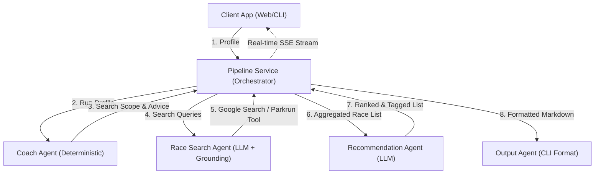

# RunMate AI 🏃

An AI-powered running companion that helps runners discover races appropriate to their experience level and location. Now featuring a modern local web application.

## Features

- **Race Discovery** — finds official races matching your level, location, distance, and month
- **Parkrun Fallback** — automatically searches for nearby Parkrun events when no official races are found
- **AI Recommendations** — explains why each race suits you, with beginner-friendly guidance
- **Multi-Agent Architecture** — Coach, Race Search, Recommendation, and Output agents work together
- **Web Dashboard** — Interactive responsive layout with runner profile settings, search history, and live SSE progress streaming
- **Cloud-Ready** — business logic is decoupled for both web interface and CLI usage

## Quick Start

### 1. Clone and set up

```bash
git clone <repo>
cd runmate-agent
python -m venv .venv
source .venv/bin/activate       # Windows: .venv\Scripts\activate
pip install -r requirements.txt
```

### 2. Configure

```bash
cp .env.example .env
# Edit .env and add your GOOGLE_API_KEY
```

Get a free Gemini API key at [aistudio.google.com](https://aistudio.google.com).

### 3. Run the Web Application

Start the FastAPI local server:

```bash
uvicorn app.main:app --reload
```

Open your browser at:
[http://localhost:8000](http://localhost:8000)

---

### 4. Run the CLI Tool (Optional)

You can also search directly from the terminal:

```bash
# Starter runner in Leeds — will recommend 5K races and Parkruns
python runmate.py --level STARTER --location "Leeds, United Kingdom"

# Experienced runner targeting a Half Marathon in October
python runmate.py --level RUNNER --location "London" --distance "Half Marathon" --month "October"

# Marathon runner in Berlin — searches all upcoming months
python runmate.py --level RUNNER --location "Berlin" --distance "Marathon"

# Save the report to output/
python runmate.py --level STARTER --location "Edinburgh" --save
```

### CLI Options

| Option | Required | Description |
|---|---|---|
| `--level` | ✅ | `STARTER` or `RUNNER` |
| `--location` | ✅ | City/region, e.g. `"Leeds, United Kingdom"` |
| `--distance` | ❌ | `5K`, `10K`, `Half Marathon`, `Marathon` (repeatable) |
| `--month` | ❌ | Month name, e.g. `October`. Defaults to next 3 months (repeatable) |
| `--save` | ❌ | Save the report to `output/` |

## Project Layout

```
runmate-agent/
│
├── app/
│   ├── api/
│   │   └── search.py           REST API router for /api/search (SSE stream)
│   │
│   ├── services/
│   │   └── pipeline_service.py Asynchronous worker orchestration service
│   │
│   ├── agent/                  Core RunMate agent logic
│   │   ├── agents/             Coach, RaceSearch, Recommendation, Output agents
│   │   ├── tools/              RaceSearch, Parkrun, LocalList, Fallback tools
│   │   ├── models/             Runner profile and race data models
│   │   ├── utils/              Retry logic and helper methods
│   │   └── prompts/            Plain text agent system prompts
│   │
│   ├── templates/
│   │   └── index.html          Main single-page HTML dashboard
│   │
│   ├── static/
│   │   ├── style.css           Custom responsive design stylesheet
│   │   └── app.js              FastAPI SSE connection client
│   │
│   └── main.py                 FastAPI server entry point
│
├── runmate.py                  CLI runner entry point
├── .env.example                Environment variable template
└── requirements.txt            Project dependency manifest
```

## Multi-Agent Architecture

RunMate AI utilizes a decoupled, orchestrator-driven multi-agent architecture designed to process runner requirements, aggregate official races, fall back to weekly community runs (parkruns), rank recommendations, and stream intermediate progress in real-time to the web client.



### Core Agents

* **🧠 Coach Agent** ([coach_agent.py](file:///Users/astux/.gemini/antigravity/scratch/runmate-agent/app/agent/agents/coach_agent.py)): Pure Python / Deterministic logic. Resolves target search months, defaults starter runner distances to `["5K"]` and runners to all common distances, and issues beginner coaching advice.
* **🔍 Race Search Agent** ([race_search_agent.py](file:///Users/astux/.gemini/antigravity/scratch/runmate-agent/app/agent/agents/race_search_agent.py)): LLM-based (`gemini-2.5-flash`) equipped with Google Search Grounding. Translates search criteria into queries, crawls live official races, and invokes fallback tools.
* **🌟 Recommendation Agent** ([recommendation_agent.py](file:///Users/astux/.gemini/antigravity/scratch/runmate-agent/app/agent/agents/recommendation_agent.py)): LLM-based (`gemini-2.5-flash`). Sorts and ranks candidates, prioritizing target-city races at the top. Highlights destination series (Abbott Marathon Majors & SuperHalfs) for experienced marathon/half-marathon runners.
* **📝 Output Agent** ([output_agent.py](file:///Users/astux/.gemini/antigravity/scratch/runmate-agent/app/agent/agents/output_agent.py)): Formatting helper. Generates rich, color-coded terminal panels for CLI outputs.

### Integrated Tools

* **🌐 Google Search Grounding Tool** ([race_search_tool.py](file:///Users/astux/.gemini/antigravity/scratch/runmate-agent/app/agent/tools/race_search_tool.py)): Connects Gemini to search indexes to extract up-to-date race listings.
* **🗺️ Parkrun Finder Tool** ([parkrun_local_list_tool.py](file:///Users/astux/.gemini/antigravity/scratch/runmate-agent/app/agent/tools/parkrun_local_list_tool.py)): Queries local Saturday morning community runs, capped to a maximum of 5 of the closest central parkruns.
* **🗃️ Historical fallback Database** ([local_list_tool.py](file:///Users/astux/.gemini/antigravity/scratch/runmate-agent/app/agent/tools/local_list_tool.py)): Returns year-round recurring local races if live crawling gets no upcoming dates.

### Real-Time SSE Stream

To keep the dashboard responsive and interactive, the backend streams agent actions using **Server-Sent Events (SSE)**.
1. **Client Connection:** The dashboard initiates an SSE listener on `/api/search`.
2. **Streaming Actions:** The orchestrator yields asynchronous JSON messages at every step (e.g. *"🏃‍♀️🏃‍♂️ Jogging around the web..."*).
3. **Interactive UI Update:** The client JavaScript dynamically updates map markers, table rows, and cards as data arrives, automatically closing parameters once complete.

## Configuration

| Variable | Default | Description |
|---|---|---|
| `GOOGLE_API_KEY` | — | **Required.** Gemini API key |
| `MODEL_NAME` | `gemini-2.5-flash` | Gemini model to use |
| `ENABLE_SEARCH_GROUNDING` | `true` | Use Google Search for real race data |
| `SAVE_REPORTS` | `false` | Auto-save reports to `output/` |

## Roadmap

- [x] Web UI / REST API (FastAPI and JavaScript Dashboard)
- [x] Interactive Event Map (Leaflet integration showing green/orange event markers)
- [x] Parkrun integration (free Saturday morning 5K mapping & zero-judgment walk alerts)
- [x] Destination race suggestions (Abbott World Marathon Majors, SuperHalfs series highlights)
- [ ] Training plan generation
- [ ] Strava integration
- [ ] Garmin Connect integration
- [ ] Weather-aware recommendations

## Safety

RunMate AI provides **informational recommendations only**. It is not a medical or coaching authority. Always consult a healthcare professional before starting a new exercise programme.

## Licence

Apache 2.0
